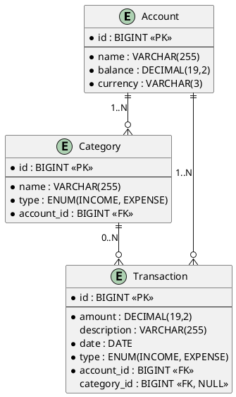
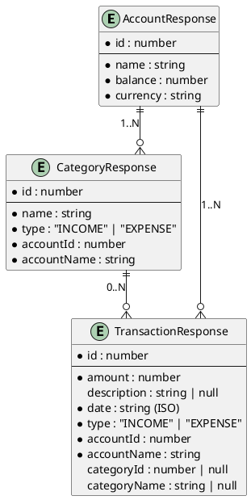
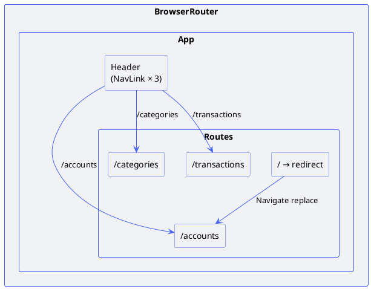
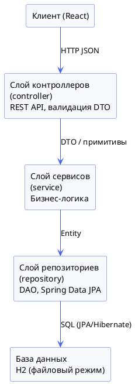
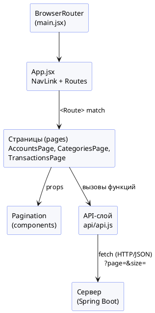
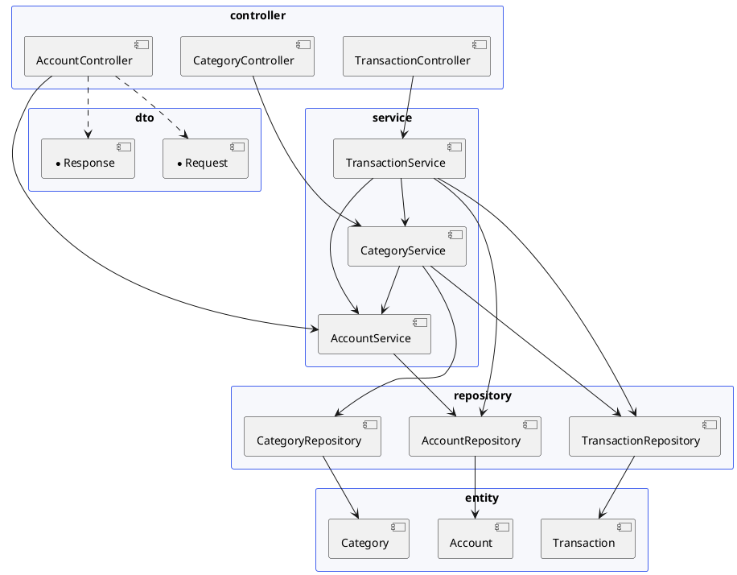

## ВВЕДЕНИЕ

В условиях современной экономики эффективное управление личными финансами приобретает всё большую значимость. Хаотичное расходование средств, отсутствие систематического учёта доходов и расходов, невозможность проанализировать структуру трат — всё это приводит к тому, что большинство людей не имеют чёткого представления о состоянии собственного бюджета. Между тем грамотное ведение личных финансов позволяет не только контролировать текущее положение дел, но и планировать будущие расходы, формировать накопления и достигать поставленных финансовых целей.

Цифровизация повседневной жизни создаёт благоприятные условия для автоматизации учёта финансов. Мобильные и веб-приложения для ведения личного бюджета пользуются устойчивым спросом: они позволяют фиксировать каждую финансовую операцию, категоризировать расходы и доходы, отслеживать динамику баланса. Разработка такого инструмента представляет практическую ценность и одновременно является хорошим примером применения современных технологий веб-разработки.

В рамках данной работы рассматривается разработка клиентской и серверной части приложения «Платформа для ведения личного бюджета и учёта расходов», предназначенного для автоматизации процессов учёта финансовых операций пользователя. Система позволяет вести несколько счетов, разбивать операции по категориям и отслеживать динамику баланса в режиме реального времени.

### Предметная область

Предметной областью разрабатываемой системы является управление личными финансами физического лица. Под личными финансами понимается совокупность денежных средств, которыми располагает человек, а также процессы их получения (доходы) и расходования (расходы).

В рамках предметной области выделяются следующие ключевые понятия.

**Счёт** — обособленный источник или место хранения денежных средств. Примерами счетов могут служить: банковская карта, наличные средства, электронный кошелёк. Каждый счёт имеет наименование, текущий баланс и валюту. Пользователь может вести несколько счетов одновременно, независимо отслеживая состояние каждого из них.

**Транзакция** — отдельная финансовая операция, изменяющая баланс счёта. Транзакция может быть доходной (пополнение: зарплата, подработка, подарок) или расходной (списание: покупка, оплата услуг, подписка). Каждая транзакция привязана к конкретному счёту и характеризуется суммой, датой и необязательным описанием.

**Категория** — тематическая классификация транзакций, позволяющая группировать операции по смысловым группам. Примеры категорий расходов: «Продукты», «Транспорт», «Развлечения», «Коммунальные услуги». Примеры категорий доходов: «Зарплата», «Фриланс», «Инвестиции». Категории привязаны к конкретному счёту и имеют тип, соответствующий типу операций (доход или расход).

### Основные сущности предметной области

В рамках системы выделяются следующие основные сущности.

**Account (Счёт)** — является центральной (основной) сущностью системы. Объединяет все транзакции и категории, принадлежащие одному источнику средств. Хранит текущий баланс, который автоматически пересчитывается при добавлении, изменении или удалении транзакций.

**Category (Категория)** — вспомогательная сущность, обеспечивающая классификацию транзакций. Каждая категория принадлежит одному счёту и имеет тип (доход или расход), совпадающий с типом транзакций, к которым она может быть применена.

**Transaction (Транзакция)** — вспомогательная сущность, представляющая конкретную финансовую операцию. Транзакция обязательно привязана к счёту и может быть дополнительно классифицирована по категории.

Между сущностями существуют связи «один-ко-многим»: один счёт может иметь множество транзакций и множество категорий.

### Бизнес-процессы, подлежащие автоматизации

**Ведение счетов.** Система автоматизирует создание и управление финансовыми счетами пользователя. Поддерживаются операции создания нового счёта с указанием начального баланса, изменения наименования и валюты, а также удаления счёта. При удалении счёта каскадно удаляются все связанные с ним категории и транзакции.

**Учёт финансовых операций.** Автоматизируется процесс фиксации каждой финансовой операции с привязкой к счёту и категории. При добавлении транзакции баланс соответствующего счёта автоматически пересчитывается: доходные операции увеличивают баланс, расходные — уменьшают. При изменении или удалении транзакции баланс корректируется соответствующим образом.

**Категоризация расходов и доходов.** Система позволяет создавать собственные категории для каждого счёта, разделяя их на доходные и расходные. Это обеспечивает структурированный учёт и возможность анализа распределения средств по направлениям.

**Просмотр и фильтрация операций.** Пользователь может просматривать историю транзакций как по отдельному счёту, так и по всем счетам сразу. Аналогично, категории могут просматриваться в разрезе конкретного счёта или всех счетов.

---

## ГЛАВА 1. ПРОЕКТИРОВАНИЕ ПРОГРАММНОЙ СИСТЕМЫ

### 1.1 Информационное обеспечение

#### Серверная часть

ER-диаграмма серверной части отражает структуру данных на уровне JPA-сущностей и связи между ними.



*Рисунок 1.1.1 — ER-диаграмма серверной части*

**Сущности и атрибуты**

**Account:**
- `id` — уникальный идентификатор счёта (PK, генерируется автоматически);
- `name` — наименование счёта (обязательное, строка);
- `balance` — текущий баланс счёта (обязательное, десятичное число);
- `currency` — код валюты (обязательное, до 3 символов, например: «RUB», «USD»).

**Category:**
- `id` — уникальный идентификатор категории (PK);
- `name` — наименование категории (обязательное, строка);
- `type` — тип категории: `INCOME` (доход) или `EXPENSE` (расход), обязательное;
- `account_id` — внешний ключ, ссылка на счёт-владелец (FK, обязательное).

**Transaction:**
- `id` — уникальный идентификатор транзакции (PK);
- `amount` — сумма операции (обязательное, десятичное число, минимум 0,01);
- `description` — текстовое описание операции (необязательное);
- `date` — дата совершения операции (обязательное);
- `type` — тип транзакции: `INCOME` (доход) или `EXPENSE` (расход), обязательное;
- `account_id` — внешний ключ, ссылка на счёт (FK, обязательное);
- `category_id` — внешний ключ, ссылка на категорию (FK, необязательное, может быть NULL).

**Связи:**
- `Account` 1:N `Category` — один счёт содержит множество категорий. Реализована через поле `account_id` в таблице `categories` с каскадным удалением (`CascadeType.ALL, orphanRemoval = true`).
- `Account` 1:N `Transaction` — один счёт содержит множество транзакций. Реализована через поле `account_id` в таблице `transactions` с каскадным удалением.
- `Category` 0:N `Transaction` — категория может быть указана у множества транзакций; ссылка необязательна. Каскад со стороны категории не установлен: при удалении категории поле `category_id` у связанных транзакций обнуляется программно в сервисном слое.

#### Клиентская часть

ER-диаграмма клиентской части отражает структуру DTO, используемых для обмена данными между сервером и браузером.



*Рисунок 1.1.2 — ER-диаграмма клиентской части (DTO)*

**Описание DTO**

**AccountResponse** — ответ при получении счёта: `id`, `name`, `balance`, `currency`. Используется как при получении списка всех счетов, так и при получении одного счёта по идентификатору.

**AccountRequest** — запрос на создание или обновление счёта: `name` (обязательное), `balance` (обязательное), `currency` (обязательное, 1–3 символа).

**CategoryResponse** — ответ при получении категории: `id`, `name`, `type`, `accountId`, `accountName`. Поле `accountName` добавлено для удобства отображения без дополнительного запроса.

**CategoryRequest** — запрос на создание или обновление категории: `name`, `type`, `accountId` (все обязательные).

**TransactionResponse** — ответ при получении транзакции: `id`, `amount`, `description`, `date`, `type`, `accountId`, `accountName`, `categoryId`, `categoryName`. Поля `categoryId` и `categoryName` могут быть `null`, если категория не указана.

**TransactionRequest** — запрос на создание или обновление транзакции: `amount` (обязательное, > 0), `description` (необязательное), `date` (обязательное), `type` (обязательное), `accountId` (обязательное), `categoryId` (необязательное).

**Описание связей на клиентской части.** На клиенте связи реализованы через поля `accountId`/`accountName` и `categoryId`/`categoryName` внутри `TransactionResponse`. Это позволяет отображать связанные данные без вложенной сериализации и без дополнительных запросов. При создании транзакции сначала загружается список счетов, затем — список категорий для выбранного счёта, что обеспечивает согласованность данных.

---

### 1.2 Интерфейс пользователя

Клиентская часть реализована как одностраничное приложение (SPA) на React 18 с использованием библиотеки React Router DOM 7. Навигация между разделами осуществляется через ссылки в верхней панели; при переходе URL в адресной строке браузера изменяется без перезагрузки страницы. Маршрутизация настроена в корневом компоненте `App` с помощью `<Routes>` и `<Route>`.

#### Страницы приложения

**Страница «Счета» (`AccountsPage`)** — отображает список всех счетов пользователя в виде таблицы с колонками: название, баланс, валюта, действия. Баланс окрашивается в зелёный цвет при положительном значении и в красный — при отрицательном. Кнопка «+ Добавить счёт» открывает модальное окно с формой создания. Кнопка «Изменить» открывает то же модальное окно с предзаполненными данными. Кнопка «Удалить» запрашивает подтверждение и удаляет счёт вместе с зависимыми данными.

[СКРИНШОТ: страница «Счета» — список счетов]

**Страница «Категории» (`CategoriesPage`)** — отображает список категорий с фильтром по счёту. Над таблицей расположен выпадающий список выбора счёта; при смене счёта таблица обновляется. Таблица содержит колонки: название, тип (цветной бейдж «Доход»/«Расход»), счёт, действия. При создании категории список счетов подставляется из уже загруженных данных.

[СКРИНШОТ: страница «Категории» — список категорий с фильтром]

**Страница «Транзакции» (`TransactionsPage`)** — отображает историю транзакций с фильтром по счёту. Таблица содержит: дату, сумму (со знаком «+»/«−» и цветовым выделением), тип (бейдж), категорию, описание, счёт, действия. При создании транзакции выбор счёта динамически обновляет список доступных категорий (только категории выбранного счёта и соответствующего типа операции).

[СКРИНШОТ: страница «Транзакции» — список транзакций]

**Модальное окно** — универсальный компонент для форм создания и редактирования всех сущностей. Отображается поверх основного контента с затемнённым фоном. Содержит поля формы, кнопки «Сохранить» и «Отмена», а также блок вывода ошибки при неудачном запросе к API.

[СКРИНШОТ: модальное окно создания транзакции]

#### Схема маршрутизации клиентской части



*Рисунок 1.2.1 — Схема маршрутизации клиентской части*

Маршрутизация реализована с помощью React Router DOM 7. `BrowserRouter` оборачивает всё приложение в `main.jsx` и обеспечивает работу с History API браузера. В `App.jsx` объявлены маршруты через `<Routes>` / `<Route>`. Для навигации используется компонент `<NavLink>`, который автоматически добавляет класс `active` к активной ссылке. Корневой маршрут `/` перенаправляет на `/accounts` через `<Navigate replace />`.

| Маршрут | Компонент | Описание |
|---|---|---|
| `/` | — | Редирект на `/accounts` |
| `/accounts` | `AccountsPage` | Список и управление счетами |
| `/categories` | `CategoriesPage` | Список и управление категориями |
| `/transactions` | `TransactionsPage` | История и управление транзакциями |

#### Компоненты интерфейса

| Компонент | Файл | Назначение |
|---|---|---|
| `App` | `App.jsx` | Корневой компонент, навигация через `NavLink`, объявление маршрутов `Routes` |
| `Pagination` | `components/Pagination.jsx` | Переиспользуемая серверная пагинация: номера страниц, prev/next, выбор размера |
| `AccountsPage` | `pages/AccountsPage.jsx` | Список счетов, форма создания/редактирования, удаление |
| `CategoriesPage` | `pages/CategoriesPage.jsx` | Список категорий с фильтром по счёту, форма создания/редактирования |
| `TransactionsPage` | `pages/TransactionsPage.jsx` | Список транзакций с фильтром, динамическая загрузка категорий, форма |

---

### 1.3 Архитектура приложения

#### Серверная часть

Серверная часть построена на Spring Boot 3.2.4 и реализует многослойную архитектуру (Layered Architecture) с чётким разделением ответственности между слоями.



*Рисунок 1.3.1 — Архитектура серверной части*

**Контроллеры (`controller`)** — принимают HTTP-запросы, десериализуют тело запроса в DTO, запускают валидацию, делегируют выполнение сервисному слою и возвращают ответные DTO. Не содержат бизнес-логики.

**Сервисы (`service`)** — реализуют бизнес-логику: проверка существования связанных сущностей, контроль согласованности типов (категория и транзакция должны иметь одинаковый тип), автоматический пересчёт баланса счёта при операциях с транзакциями, преобразование Entity ↔ Response DTO.

**Репозитории (`repository`)** — интерфейсы Spring Data JPA, наследующие `JpaRepository`. Предоставляют стандартные CRUD-операции, а также дополнительные методы запросов (поиск по `accountId`, сортировка по дате).

**Сущности (`entity`)** — JPA-аннотированные классы, отображаемые на таблицы базы данных. Содержат описание столбцов, связей (`@OneToMany`, `@ManyToOne`) и ограничений.

**DTO (`dto`)** — объекты для передачи данных между клиентом и сервером. Разделены на `*Request` (входящие, с аннотациями валидации) и `*Response` (исходящие).

**Исключения (`exception`)** — `ResourceNotFoundException` для случаев отсутствия запрошенной сущности, `GlobalExceptionHandler` для централизованной обработки ошибок и формирования единообразных JSON-ответов.

**Конфигурация (`config`)** — `WebConfig` с настройкой CORS для разрешения запросов с фронтенд-сервера (`http://localhost:5173`).

#### Клиентская часть



*Рисунок 1.3.2 — Архитектура клиентской части*

**`BrowserRouter` (`main.jsx`)** — оборачивает приложение и предоставляет контекст History API для всех дочерних компонентов.

**Корневой компонент (`App.jsx`)** — объявляет маршруты через `<Routes>` / `<Route>`, рендерит шапку с `<NavLink>` для навигации.

**Страницы (`pages`)** — самодостаточные React-компоненты, реализующие пользовательские сценарии. Каждая страница управляет собственным локальным состоянием (`useState`), загружает данные при изменении зависимостей `page`, `pageSize`, `filterAccountId` через `useEffect`.

**Пагинация (`components/Pagination.jsx`)** — переиспользуемый компонент. Принимает `page`, `totalItems`, `pageSize`, коллбэки `onPage` / `onPageSize`. Рендерит номера страниц с эллипсисом, кнопки prev/next и селект размера страницы.

**API-слой (`api/api.js`)** — единая точка сетевого взаимодействия. Все запросы списков принимают параметры `page` и `size`, которые передаются как query-параметры. Инкапсулирует работу с `fetch`, базовый URL и обработку ошибок HTTP.

---

### 1.4 Программный интерфейс и функции серверной части

REST API имеет общий префикс `/api` и организован по ресурсам. Каждый ресурс поддерживает полный набор CRUD-операций.

#### AccountController — `/api/accounts`

| Метод | URL | Описание | Код ответа |
|---|---|---|---|
| GET | `/api/accounts` | Получить список всех счетов | 200 |
| GET | `/api/accounts/{id}` | Получить счёт по идентификатору | 200 / 404 |
| POST | `/api/accounts` | Создать новый счёт | 201 |
| PUT | `/api/accounts/{id}` | Обновить счёт | 200 / 404 |
| DELETE | `/api/accounts/{id}` | Удалить счёт | 204 / 404 |

#### CategoryController — `/api/categories`

| Метод | URL | Описание | Код ответа |
|---|---|---|---|
| GET | `/api/categories` | Список всех категорий | 200 |
| GET | `/api/categories?accountId={id}` | Список категорий конкретного счёта | 200 |
| GET | `/api/categories/{id}` | Категория по идентификатору | 200 / 404 |
| POST | `/api/categories` | Создать категорию | 201 |
| PUT | `/api/categories/{id}` | Обновить категорию | 200 / 404 |
| DELETE | `/api/categories/{id}` | Удалить категорию | 204 / 404 |

#### TransactionController — `/api/transactions`

| Метод | URL | Описание | Код ответа |
|---|---|---|---|
| GET | `/api/transactions` | Список всех транзакций | 200 |
| GET | `/api/transactions?accountId={id}` | Транзакции конкретного счёта (по убыванию даты) | 200 |
| GET | `/api/transactions/{id}` | Транзакция по идентификатору | 200 / 404 |
| POST | `/api/transactions` | Создать транзакцию | 201 |
| PUT | `/api/transactions/{id}` | Обновить транзакцию | 200 / 404 |
| DELETE | `/api/transactions/{id}` | Удалить транзакцию | 204 / 404 |

#### Структура DTO и валидация

**AccountRequest:**
```java
@NotBlank(message = "Название не может быть пустым")
private String name;

@NotNull(message = "Баланс обязателен")
private BigDecimal balance;

@NotBlank @Size(min = 1, max = 3, message = "Валюта: 1-3 символа")
private String currency;
```

**CategoryRequest:**
```java
@NotBlank(message = "Название не может быть пустым")
private String name;

@NotNull(message = "Тип обязателен")
private TransactionType type;

@NotNull(message = "Счёт обязателен")
private Long accountId;
```

**TransactionRequest:**
```java
@NotNull @DecimalMin(value = "0.01", message = "Сумма должна быть больше 0")
private BigDecimal amount;

private String description;          // необязательное

@NotNull(message = "Дата обязательна")
private LocalDate date;

@NotNull(message = "Тип обязателен")
private TransactionType type;

@NotNull(message = "Счёт обязателен")
private Long accountId;

private Long categoryId;             // необязательное
```

При нарушении ограничений валидации `GlobalExceptionHandler` перехватывает `MethodArgumentNotValidException` и возвращает ответ с кодом 400 в виде JSON-объекта, где ключами являются имена полей, а значениями — сообщения об ошибках.

Дополнительная бизнес-валидация выполняется в сервисном слое: при создании транзакции с указанной категорией проверяется, что тип категории совпадает с типом транзакции; при несоответствии выбрасывается `IllegalArgumentException`, которое `GlobalExceptionHandler` преобразует в ответ с кодом 400.

---

## ГЛАВА 2. РАЗРАБОТКА ПРОГРАММНОЙ СИСТЕМЫ

### 2.1 Слои приложения

Серверная часть приложения организована по принципу многослойной архитектуры. Исходный код расположен в пакете `com.budget` и разбит на следующие подпакеты:

| Пакет | Назначение |
|---|---|
| `com.budget.entity` | JPA-сущности и перечисление `TransactionType` |
| `com.budget.repository` | Интерфейсы Spring Data JPA (DAO) |
| `com.budget.dto` | Request- и Response-DTO |
| `com.budget.service` | Сервисные классы с бизнес-логикой |
| `com.budget.controller` | REST-контроллеры |
| `com.budget.exception` | Классы исключений и глобальный обработчик |
| `com.budget.config` | Конфигурационные классы (CORS) |



*Рисунок 2.1.1 — Схема взаимодействия слоёв серверной части*

**Технологический стек серверной части:**
- Java 25, Spring Boot 3.2.4
- Spring Data JPA + Hibernate 6.4 (ORM)
- Spring Validation (Bean Validation / Jakarta Validation)
- H2 Database (файловый режим, `jdbc:h2:file:./data/budgetdb`)
- Lombok 1.18.38 (генерация геттеров, сеттеров, конструкторов)
- Gradle 8.14.4 (система сборки)

---

### 2.2 Слой доступа к данным

Доступ к данным реализован через интерфейсы Spring Data JPA, которые являются DAO (Data Access Object) для каждой сущности. Интерфейсы наследуют `JpaRepository<T, ID>`, предоставляющий готовые реализации стандартных операций: `save`, `findById`, `findAll`, `delete` и другие.

#### AccountRepository

```java
public interface AccountRepository extends JpaRepository<Account, Long> {
}
```

Использует только унаследованные методы `JpaRepository`. Дополнительные запросы не требуются, так как счета не фильтруются по дополнительным критериям.

Основные используемые методы:
- `findAll()` — получение списка всех счетов;
- `findById(Long id)` — получение счёта по идентификатору (возвращает `Optional<Account>`);
- `save(Account account)` — сохранение или обновление счёта;
- `delete(Account account)` — удаление счёта.

#### CategoryRepository

```java
public interface CategoryRepository extends JpaRepository<Category, Long> {
    List<Category> findByAccountId(Long accountId);
    List<Category> findByAccountIdAndType(Long accountId, TransactionType type);
}
```

Дополнительные методы:
- `findByAccountId(Long accountId)` — получение всех категорий, принадлежащих указанному счёту. Используется при фильтрации на странице «Категории» и при динамической загрузке категорий для формы создания транзакции;
- `findByAccountIdAndType(Long accountId, TransactionType type)` — получение категорий конкретного счёта с фильтрацией по типу (доход/расход). Метод определён в интерфейсе и может применяться для расширенной фильтрации.

#### TransactionRepository

```java
public interface TransactionRepository extends JpaRepository<Transaction, Long> {
    List<Transaction> findByAccountIdOrderByDateDesc(Long accountId);
}
```

Дополнительные методы:
- `findByAccountIdOrderByDateDesc(Long accountId)` — получение всех транзакций счёта, отсортированных по дате в убывающем порядке. Используется при отображении истории операций.

Имена методов `findByAccountId` и `findByAccountIdOrderByDateDesc` следуют соглашению Spring Data JPA об именовании методов (Derived Query Methods): Spring автоматически генерирует реализацию SQL-запроса по имени метода без написания кода.

---

### 2.3 Слой бизнес-логики

Сервисный слой содержит всю бизнес-логику приложения. Каждый сервисный класс аннотирован `@Service` и внедряет зависимости через конструктор (`@RequiredArgsConstructor` Lombok).

#### AccountService

**Поля:**
- `AccountRepository accountRepository` — DAO для счетов.

**Методы:**

| Метод | Описание |
|---|---|
| `findAll() : List<AccountResponse>` | Получение списка всех счетов, преобразование в DTO |
| `findById(Long id) : AccountResponse` | Получение счёта по id, выброс `ResourceNotFoundException` при отсутствии |
| `create(AccountRequest dto) : AccountResponse` | Создание нового счёта с заданными полями |
| `update(Long id, AccountRequest dto) : AccountResponse` | Обновление наименования и валюты счёта (баланс изменяется только через транзакции) |
| `delete(Long id)` | Удаление счёта (каскадно удаляет категории и транзакции через JPA) |
| `getOrThrow(Long id) : Account` | Внутренний вспомогательный метод: получение сущности или выброс исключения |

Метод `getOrThrow` является пакетно доступным и используется другими сервисами (`CategoryService`, `TransactionService`) для получения сущности `Account` с гарантированной проверкой существования.

#### CategoryService

**Поля:**
- `CategoryRepository categoryRepository` — DAO для категорий;
- `TransactionRepository transactionRepository` — DAO для транзакций (используется при удалении категории);
- `AccountService accountService` — для получения связанного счёта.

**Методы:**

| Метод | Описание |
|---|---|
| `findAll() : List<CategoryResponse>` | Список всех категорий |
| `findByAccountId(Long accountId) : List<CategoryResponse>` | Список категорий конкретного счёта |
| `findById(Long id) : CategoryResponse` | Категория по id |
| `create(CategoryRequest dto) : CategoryResponse` | Создание категории с привязкой к счёту |
| `update(Long id, CategoryRequest dto) : CategoryResponse` | Обновление наименования, типа и счёта категории |
| `delete(Long id)` | Удаление категории с предварительным обнулением ссылки в транзакциях |
| `getOrThrow(Long id) : Category` | Получение сущности или исключение |

**Логика удаления категории:** перед удалением сервис находит все транзакции данного счёта, фильтрует те, у которых `category == deletedCategory`, устанавливает им `category = null` и сохраняет. После этого категория удаляется без нарушения ссылочной целостности.

#### TransactionService

**Поля:**
- `TransactionRepository transactionRepository`;
- `AccountRepository accountRepository`;
- `AccountService accountService`;
- `CategoryService categoryService`.

**Методы:**

| Метод | Описание |
|---|---|
| `findAll() : List<TransactionResponse>` | Список всех транзакций |
| `findByAccountId(Long accountId) : List<TransactionResponse>` | Транзакции счёта, сортировка по дате убыванием |
| `findById(Long id) : TransactionResponse` | Транзакция по id |
| `create(TransactionRequest dto) : TransactionResponse` | Создание транзакции с пересчётом баланса |
| `update(Long id, TransactionRequest dto) : TransactionResponse` | Обновление транзакции: откат старого баланса, применение нового |
| `delete(Long id)` | Удаление транзакции с откатом изменения баланса |

**Логика пересчёта баланса:**

При **создании** транзакции:
- тип `INCOME` → `account.balance += amount`;
- тип `EXPENSE` → `account.balance -= amount`.

При **удалении** — операция инвертируется:
- тип `INCOME` → `account.balance -= amount`;
- тип `EXPENSE` → `account.balance += amount`.

При **обновлении** последовательно выполняются: откат эффекта старой транзакции (на старом счёте), затем применение нового эффекта (на новом счёте). Это корректно обрабатывает случай смены счёта при редактировании.

Дополнительная проверка: при указании категории её тип должен совпадать с типом транзакции, иначе выбрасывается `IllegalArgumentException`.

---

### 2.4 Слой представления (контроллеры)

Контроллеры аннотированы `@RestController` и `@RequestMapping`. Для внедрения зависимостей используется конструктор (`@RequiredArgsConstructor`). Входящие данные валидируются аннотацией `@Valid` на параметре метода.

#### AccountController

```
@RestController
@RequestMapping("/api/accounts")
```

| Метод | Аннотация | Параметры | Возвращает |
|---|---|---|---|
| `getAll` | `@GetMapping` | — | `List<AccountResponse>` |
| `getById` | `@GetMapping("/{id}")` | `@PathVariable Long id` | `AccountResponse` |
| `create` | `@PostMapping` | `@Valid @RequestBody AccountRequest` | `AccountResponse`, 201 |
| `update` | `@PutMapping("/{id}")` | `id`, `@Valid @RequestBody AccountRequest` | `AccountResponse` |
| `delete` | `@DeleteMapping("/{id}")` | `@PathVariable Long id` | void, 204 |

#### CategoryController

```
@RestController
@RequestMapping("/api/categories")
```

| Метод | Аннотация | Параметры | Возвращает |
|---|---|---|---|
| `getAll` | `@GetMapping` | `@RequestParam(required=false) Long accountId` | `List<CategoryResponse>` |
| `getById` | `@GetMapping("/{id}")` | `@PathVariable Long id` | `CategoryResponse` |
| `create` | `@PostMapping` | `@Valid @RequestBody CategoryRequest` | `CategoryResponse`, 201 |
| `update` | `@PutMapping("/{id}")` | `id`, `@Valid @RequestBody CategoryRequest` | `CategoryResponse` |
| `delete` | `@DeleteMapping("/{id}")` | `@PathVariable Long id` | void, 204 |

Параметр `accountId` в методе `getAll` является необязательным: при его наличии выполняется фильтрация по счёту, при отсутствии возвращаются все категории.

#### TransactionController

```
@RestController
@RequestMapping("/api/transactions")
```

| Метод | Аннотация | Параметры | Возвращает |
|---|---|---|---|
| `getAll` | `@GetMapping` | `@RequestParam(required=false) Long accountId` | `List<TransactionResponse>` |
| `getById` | `@GetMapping("/{id}")` | `@PathVariable Long id` | `TransactionResponse` |
| `create` | `@PostMapping` | `@Valid @RequestBody TransactionRequest` | `TransactionResponse`, 201 |
| `update` | `@PutMapping("/{id}")` | `id`, `@Valid @RequestBody TransactionRequest` | `TransactionResponse` |
| `delete` | `@DeleteMapping("/{id}")` | `@PathVariable Long id` | void, 204 |

#### GlobalExceptionHandler

```
@RestControllerAdvice
```

| Обработчик | Исключение | Код ответа | Тело |
|---|---|---|---|
| `handleNotFound` | `ResourceNotFoundException` | 404 | `{"error": "сообщение"}` |
| `handleValidation` | `MethodArgumentNotValidException` | 400 | `{"field": "сообщение", ...}` |
| `handleIllegalArg` | `IllegalArgumentException` | 400 | `{"error": "сообщение"}` |

---

## ГЛАВА 3. РУКОВОДСТВО ПОЛЬЗОВАТЕЛЯ

### 3.1 Запуск приложения

#### Запуск серверной части

Для запуска серверной части необходимо выполнить следующие шаги.

1. Убедиться, что установлена Java версии 17 или выше.
2. Перейти в директорию `backend` проекта.
3. Выполнить команду запуска через Gradle wrapper:

```bash
cd backend
./gradlew bootRun
```

После успешного запуска в консоли появится сообщение о старте приложения на порту 8080:

```
Started BudgetApplication in 2.1 seconds
```

Файлы базы данных H2 автоматически создаются в директории `backend/data/` при первом запуске и сохраняются между перезапусками.

#### Запуск клиентской части

1. Убедиться, что установлены Node.js версии 18 или выше и npm.
2. При первом запуске установить зависимости:

```bash
cd frontend
npm install
```

3. Запустить сервер разработки:

```bash
npm run dev
```

4. Открыть браузер и перейти по адресу: `http://localhost:5173`

### 3.2 Работа со счетами

Счета — это финансовые источники (карты, наличные, кошельки). Управление счетами доступно на вкладке **«Счета»**.

#### Создание счёта

1. Нажать кнопку **«+ Добавить счёт»** в правом верхнем углу страницы.
2. В открывшемся модальном окне заполнить поля:
   - **Название** — наименование счёта (например, «Дебетовая карта», «Наличные»);
   - **Начальный баланс** — текущий остаток средств на счёте в момент создания (можно указать `0`);
   - **Валюта** — трёхбуквенный код валюты (например, `RUB`, `USD`, `EUR`).
3. Нажать **«Сохранить»**.

[СКРИНШОТ: модальное окно создания счёта с заполненными полями]

После сохранения новый счёт отобразится в таблице. Баланс окрашивается в зелёный цвет при положительном значении.

#### Редактирование счёта

1. В строке нужного счёта нажать кнопку **«Изменить»**.
2. В модальном окне доступно изменение **названия** и **валюты** счёта.
3. Нажать **«Сохранить»**.

*Примечание: баланс счёта изменяется автоматически при добавлении и удалении транзакций. Для ручной корректировки баланса рекомендуется создать корректирующую транзакцию.*

#### Удаление счёта

1. В строке нужного счёта нажать кнопку **«Удалить»**.
2. Подтвердить удаление во всплывающем диалоге.

> **Внимание:** при удалении счёта все связанные с ним категории и транзакции удаляются безвозвратно.

[СКРИНШОТ: страница «Счета» с несколькими счетами]

### 3.3 Работа с категориями

Категории позволяют классифицировать доходы и расходы. Управление категориями доступно на вкладке **«Категории»**.

#### Фильтрация по счёту

В верхней части страницы расположен выпадающий список **«Счёт»**. При выборе конкретного счёта отображаются только его категории. Значение «Все» показывает категории всех счетов.

#### Создание категории

1. Нажать кнопку **«+ Добавить категорию»**.
2. Заполнить поля:
   - **Название** — наименование категории (например, «Продукты», «Зарплата»);
   - **Тип** — выбрать «Расход» или «Доход»;
   - **Счёт** — выбрать счёт, к которому будет относиться категория.
3. Нажать **«Сохранить»**.

[СКРИНШОТ: модальное окно создания категории]

#### Редактирование и удаление категории

Аналогично работе со счетами: кнопки «Изменить» и «Удалить» доступны в строке каждой категории.

*Примечание: при удалении категории транзакции, использовавшие её, не удаляются — они лишь остаются без категории.*

[СКРИНШОТ: страница «Категории» с несколькими категориями разных типов]

### 3.4 Работа с транзакциями

Транзакции — основной инструмент учёта. Каждая транзакция фиксирует факт прихода или расхода средств. Управление транзакциями доступно на вкладке **«Транзакции»**.

#### Создание транзакции

1. Нажать кнопку **«+ Добавить транзакцию»**.
2. Заполнить поля:
   - **Тип** — «Расход» или «Доход»;
   - **Счёт** — выбрать счёт (после выбора динамически загружается список подходящих категорий);
   - **Сумма** — сумма операции (положительное число);
   - **Дата** — дата операции (по умолчанию — сегодня);
   - **Категория** — необязательное поле, список содержит только категории выбранного счёта и выбранного типа;
   - **Описание** — необязательное текстовое описание.
3. Нажать **«Сохранить»**.

[СКРИНШОТ: модальное окно создания транзакции с заполненными полями]

После сохранения транзакция появится в таблице, а баланс соответствующего счёта автоматически обновится.

#### Просмотр транзакций

Таблица транзакций содержит: дату, сумму (зелёная с «+» — доход, красная с «−» — расход), тип (цветной бейдж), категорию, описание, счёт.

Для фильтрации по счёту используется выпадающий список вверху страницы.

[СКРИНШОТ: страница «Транзакции» со списком операций]

### 3.5 Контрольный пример работы с приложением

Ниже представлен полный сценарий использования приложения — от запуска до получения структурированного учёта.

**Шаг 1. Запустить бэкенд и фронтенд** согласно разделу 3.1.

**Шаг 2. Создать счёт.**
Перейти на вкладку «Счета», нажать «+ Добавить счёт», указать:
- Название: `Основная карта`
- Начальный баланс: `50000`
- Валюта: `RUB`

Сохранить. В таблице появится счёт с балансом `50000.00`.

[СКРИНШОТ: таблица счетов после добавления «Основная карта»]

**Шаг 3. Создать категории.**
Перейти на вкладку «Категории».

Добавить категорию расходов:
- Название: `Продукты`, Тип: Расход, Счёт: Основная карта.

Добавить категорию доходов:
- Название: `Зарплата`, Тип: Доход, Счёт: Основная карта.

[СКРИНШОТ: таблица категорий с двумя категориями]

**Шаг 4. Добавить транзакции.**
Перейти на вкладку «Транзакции».

Добавить доходную транзакцию:
- Тип: Доход, Счёт: Основная карта, Сумма: `80000`, Дата: текущая, Категория: Зарплата, Описание: `Зарплата за апрель`.

После сохранения баланс счёта станет `130000.00`.

Добавить расходную транзакцию:
- Тип: Расход, Счёт: Основная карта, Сумма: `3500`, Дата: текущая, Категория: Продукты, Описание: `Поход в супермаркет`.

После сохранения баланс счёта станет `126500.00`.

[СКРИНШОТ: таблица транзакций с двумя операциями]

**Шаг 5. Убедиться в корректности баланса.**
Перейти на вкладку «Счета». Баланс счёта «Основная карта» должен отображаться как `126500.00`.

[СКРИНШОТ: таблица счетов с обновлённым балансом]

Контрольный пример демонстрирует полный цикл работы с приложением: создание счёта, формирование категорий, внесение транзакций и автоматический пересчёт баланса.

---

## ВЫВОДЫ

В ходе выполнения курсовой работы была разработана полнофункциональная веб-система «Платформа для ведения личного бюджета и учёта расходов», включающая серверную и клиентскую части.

**Результаты работы:**

В части проектирования была разработана доменная модель, включающая три сущности: `Account` (основная), `Category` и `Transaction` (вспомогательные). Между сущностями установлены связи «один-ко-многим», реализованные средствами JPA. Спроектированы ER-диаграммы на уровне базы данных и на уровне DTO. Разработан пользовательский интерфейс с тремя функциональными страницами.

В части реализации серверной части создано Spring Boot приложение с многослойной архитектурой: слой доступа к данным на основе Spring Data JPA (репозитории), слой бизнес-логики (сервисные классы) и слой представления (REST-контроллеры). Реализована валидация входящих данных с помощью Jakarta Bean Validation и централизованная обработка ошибок. Разработан механизм автоматического пересчёта баланса счёта при изменении транзакций.

В части реализации клиентской части создано одностраничное приложение на React 18 с использованием Vite. Реализованы три страницы: управление счетами, категориями и транзакциями. Разработан API-слой для взаимодействия с сервером. Добавлена динамическая фильтрация категорий по счёту и типу при создании транзакции.

**Выполненные требования к системе:**
- доменная модель содержит три сущности с необходимыми связями ✓;
- персистентность данных реализована через JPA для каждой сущности ✓;
- доступ к данным осуществляется через DAO (Spring Data JPA Repository) для каждой сущности ✓;
- бизнес-логика выделена в отдельные классы (AccountService, CategoryService, TransactionService) ✓;
- реализованы REST-контроллеры для каждой сущности ✓;
- используются DTO и валидация для всех контроллеров ✓;
- клиентская часть реализована на React с поддержкой всех сущностей ✓.

В процессе разработки приобретены практические навыки построения многослойных серверных приложений на Spring Boot, проектирования REST API, работы с JPA/Hibernate, а также разработки клиентских SPA-приложений на React с взаимодействием через HTTP API.

---

## ИСХОДНЫЙ КОД

*Исходный код приводится в двух колонках, шрифт 8 пт.*

### Серверная часть

#### `BudgetApplication.java`
```java
package com.budget;

import org.springframework.boot.SpringApplication;
import org.springframework.boot.autoconfigure.SpringBootApplication;

@SpringBootApplication
public class BudgetApplication {
    public static void main(String[] args) {
        SpringApplication.run(BudgetApplication.class, args);
    }
}
```

#### `entity/TransactionType.java`
```java
package com.budget.entity;

public enum TransactionType {
    INCOME, EXPENSE
}
```

#### `entity/Account.java`
```java
package com.budget.entity;

import jakarta.persistence.*;
import lombok.*;
import java.math.BigDecimal;
import java.util.ArrayList;
import java.util.List;

@Entity
@Table(name = "accounts")
@Getter @Setter @NoArgsConstructor @AllArgsConstructor
@ToString(exclude = {"categories", "transactions"})
@EqualsAndHashCode(of = "id")
public class Account {
    @Id
    @GeneratedValue(strategy = GenerationType.IDENTITY)
    private Long id;

    @Column(nullable = false)
    private String name;

    @Column(nullable = false)
    private BigDecimal balance = BigDecimal.ZERO;

    @Column(nullable = false, length = 3)
    private String currency = "RUB";

    @OneToMany(mappedBy = "account",
        cascade = CascadeType.ALL, orphanRemoval = true)
    private List<Category> categories = new ArrayList<>();

    @OneToMany(mappedBy = "account",
        cascade = CascadeType.ALL, orphanRemoval = true)
    private List<Transaction> transactions = new ArrayList<>();
}
```

#### `entity/Category.java`
```java
package com.budget.entity;

import jakarta.persistence.*;
import lombok.*;
import java.util.ArrayList;
import java.util.List;

@Entity
@Table(name = "categories")
@Getter @Setter @NoArgsConstructor @AllArgsConstructor
@ToString(exclude = {"account", "transactions"})
@EqualsAndHashCode(of = "id")
public class Category {
    @Id
    @GeneratedValue(strategy = GenerationType.IDENTITY)
    private Long id;

    @Column(nullable = false)
    private String name;

    @Enumerated(EnumType.STRING)
    @Column(nullable = false)
    private TransactionType type;

    @ManyToOne(fetch = FetchType.LAZY)
    @JoinColumn(name = "account_id", nullable = false)
    private Account account;

    @OneToMany(mappedBy = "category")
    private List<Transaction> transactions = new ArrayList<>();
}
```

#### `entity/Transaction.java`
```java
package com.budget.entity;

import jakarta.persistence.*;
import lombok.*;
import java.math.BigDecimal;
import java.time.LocalDate;

@Entity
@Table(name = "transactions")
@Getter @Setter @NoArgsConstructor @AllArgsConstructor
@ToString(exclude = {"account", "category"})
@EqualsAndHashCode(of = "id")
public class Transaction {
    @Id
    @GeneratedValue(strategy = GenerationType.IDENTITY)
    private Long id;

    @Column(nullable = false)
    private BigDecimal amount;

    private String description;

    @Column(nullable = false)
    private LocalDate date;

    @Enumerated(EnumType.STRING)
    @Column(nullable = false)
    private TransactionType type;

    @ManyToOne(fetch = FetchType.LAZY)
    @JoinColumn(name = "account_id", nullable = false)
    private Account account;

    @ManyToOne(fetch = FetchType.LAZY)
    @JoinColumn(name = "category_id")
    private Category category;
}
```

#### `repository/AccountRepository.java`
```java
package com.budget.repository;

import com.budget.entity.Account;
import org.springframework.data.jpa.repository.JpaRepository;

public interface AccountRepository
        extends JpaRepository<Account, Long> {
}
```

#### `repository/CategoryRepository.java`
```java
package com.budget.repository;

import com.budget.entity.Category;
import com.budget.entity.TransactionType;
import org.springframework.data.jpa.repository.JpaRepository;
import java.util.List;

public interface CategoryRepository
        extends JpaRepository<Category, Long> {
    List<Category> findByAccountId(Long accountId);
    List<Category> findByAccountIdAndType(
            Long accountId, TransactionType type);
}
```

#### `repository/TransactionRepository.java`
```java
package com.budget.repository;

import com.budget.entity.Transaction;
import org.springframework.data.jpa.repository.JpaRepository;
import java.util.List;

public interface TransactionRepository
        extends JpaRepository<Transaction, Long> {
    List<Transaction> findByAccountIdOrderByDateDesc(
            Long accountId);
}
```

#### `dto/AccountRequest.java`
```java
package com.budget.dto;

import jakarta.validation.constraints.*;
import lombok.Data;
import java.math.BigDecimal;

@Data
public class AccountRequest {
    @NotBlank(message = "Название не может быть пустым")
    private String name;

    @NotNull(message = "Баланс обязателен")
    private BigDecimal balance;

    @NotBlank
    @Size(min = 1, max = 3, message = "Валюта: 1-3 символа")
    private String currency;
}
```

#### `dto/AccountResponse.java`
```java
package com.budget.dto;

import lombok.Data;
import java.math.BigDecimal;

@Data
public class AccountResponse {
    private Long id;
    private String name;
    private BigDecimal balance;
    private String currency;
}
```

#### `dto/CategoryRequest.java`
```java
package com.budget.dto;

import com.budget.entity.TransactionType;
import jakarta.validation.constraints.*;
import lombok.Data;

@Data
public class CategoryRequest {
    @NotBlank(message = "Название не может быть пустым")
    private String name;

    @NotNull(message = "Тип обязателен")
    private TransactionType type;

    @NotNull(message = "Счёт обязателен")
    private Long accountId;
}
```

#### `dto/CategoryResponse.java`
```java
package com.budget.dto;

import com.budget.entity.TransactionType;
import lombok.Data;

@Data
public class CategoryResponse {
    private Long id;
    private String name;
    private TransactionType type;
    private Long accountId;
    private String accountName;
}
```

#### `dto/TransactionRequest.java`
```java
package com.budget.dto;

import com.budget.entity.TransactionType;
import jakarta.validation.constraints.*;
import lombok.Data;
import java.math.BigDecimal;
import java.time.LocalDate;

@Data
public class TransactionRequest {
    @NotNull
    @DecimalMin(value = "0.01",
        message = "Сумма должна быть больше 0")
    private BigDecimal amount;

    private String description;

    @NotNull(message = "Дата обязательна")
    private LocalDate date;

    @NotNull(message = "Тип обязателен")
    private TransactionType type;

    @NotNull(message = "Счёт обязателен")
    private Long accountId;

    private Long categoryId;
}
```

#### `dto/TransactionResponse.java`
```java
package com.budget.dto;

import com.budget.entity.TransactionType;
import lombok.Data;
import java.math.BigDecimal;
import java.time.LocalDate;

@Data
public class TransactionResponse {
    private Long id;
    private BigDecimal amount;
    private String description;
    private LocalDate date;
    private TransactionType type;
    private Long accountId;
    private String accountName;
    private Long categoryId;
    private String categoryName;
}
```

#### `service/AccountService.java`
```java
package com.budget.service;

import com.budget.dto.*;
import com.budget.entity.Account;
import com.budget.exception.ResourceNotFoundException;
import com.budget.repository.AccountRepository;
import lombok.RequiredArgsConstructor;
import org.springframework.stereotype.Service;
import org.springframework.transaction.annotation.Transactional;
import java.util.List;

@Service
@RequiredArgsConstructor
public class AccountService {
    private final AccountRepository accountRepository;

    public List<AccountResponse> findAll() {
        return accountRepository.findAll().stream()
                .map(this::toResponse).toList();
    }

    public AccountResponse findById(Long id) {
        return toResponse(getOrThrow(id));
    }

    @Transactional
    public AccountResponse create(AccountRequest dto) {
        Account a = new Account();
        a.setName(dto.getName());
        a.setBalance(dto.getBalance());
        a.setCurrency(dto.getCurrency());
        return toResponse(accountRepository.save(a));
    }

    @Transactional
    public AccountResponse update(Long id, AccountRequest dto) {
        Account a = getOrThrow(id);
        a.setName(dto.getName());
        a.setCurrency(dto.getCurrency());
        return toResponse(accountRepository.save(a));
    }

    @Transactional
    public void delete(Long id) {
        accountRepository.delete(getOrThrow(id));
    }

    public Account getOrThrow(Long id) {
        return accountRepository.findById(id)
                .orElseThrow(() -> new ResourceNotFoundException(
                        "Счёт с id=" + id + " не найден"));
    }

    private AccountResponse toResponse(Account a) {
        AccountResponse r = new AccountResponse();
        r.setId(a.getId());
        r.setName(a.getName());
        r.setBalance(a.getBalance());
        r.setCurrency(a.getCurrency());
        return r;
    }
}
```

#### `service/CategoryService.java`
```java
package com.budget.service;

import com.budget.dto.*;
import com.budget.entity.*;
import com.budget.exception.ResourceNotFoundException;
import com.budget.repository.*;
import lombok.RequiredArgsConstructor;
import org.springframework.stereotype.Service;
import org.springframework.transaction.annotation.Transactional;
import java.util.List;

@Service
@RequiredArgsConstructor
public class CategoryService {
    private final CategoryRepository categoryRepository;
    private final TransactionRepository transactionRepository;
    private final AccountService accountService;

    public List<CategoryResponse> findAll() {
        return categoryRepository.findAll().stream()
                .map(this::toResponse).toList();
    }

    public List<CategoryResponse> findByAccountId(Long accountId) {
        return categoryRepository.findByAccountId(accountId)
                .stream().map(this::toResponse).toList();
    }

    public CategoryResponse findById(Long id) {
        return toResponse(getOrThrow(id));
    }

    @Transactional
    public CategoryResponse create(CategoryRequest dto) {
        Account account = accountService.getOrThrow(dto.getAccountId());
        Category c = new Category();
        c.setName(dto.getName());
        c.setType(dto.getType());
        c.setAccount(account);
        return toResponse(categoryRepository.save(c));
    }

    @Transactional
    public CategoryResponse update(Long id, CategoryRequest dto) {
        Category c = getOrThrow(id);
        c.setName(dto.getName());
        c.setType(dto.getType());
        c.setAccount(accountService.getOrThrow(dto.getAccountId()));
        return toResponse(categoryRepository.save(c));
    }

    @Transactional
    public void delete(Long id) {
        Category c = getOrThrow(id);
        transactionRepository
                .findByAccountIdOrderByDateDesc(c.getAccount().getId())
                .stream().filter(t -> c.equals(t.getCategory()))
                .forEach(t -> {
                    t.setCategory(null);
                    transactionRepository.save(t);
                });
        categoryRepository.delete(c);
    }

    public Category getOrThrow(Long id) {
        return categoryRepository.findById(id)
                .orElseThrow(() -> new ResourceNotFoundException(
                        "Категория с id=" + id + " не найдена"));
    }

    private CategoryResponse toResponse(Category c) {
        CategoryResponse r = new CategoryResponse();
        r.setId(c.getId());
        r.setName(c.getName());
        r.setType(c.getType());
        r.setAccountId(c.getAccount().getId());
        r.setAccountName(c.getAccount().getName());
        return r;
    }
}
```

#### `service/TransactionService.java`
```java
package com.budget.service;

import com.budget.dto.*;
import com.budget.entity.*;
import com.budget.exception.ResourceNotFoundException;
import com.budget.repository.*;
import lombok.RequiredArgsConstructor;
import org.springframework.stereotype.Service;
import org.springframework.transaction.annotation.Transactional;
import java.math.BigDecimal;
import java.util.List;

@Service
@RequiredArgsConstructor
public class TransactionService {
    private final TransactionRepository transactionRepository;
    private final AccountRepository accountRepository;
    private final AccountService accountService;
    private final CategoryService categoryService;

    public List<TransactionResponse> findAll() {
        return transactionRepository.findAll().stream()
                .map(this::toResponse).toList();
    }

    public List<TransactionResponse> findByAccountId(Long accountId) {
        return transactionRepository
                .findByAccountIdOrderByDateDesc(accountId)
                .stream().map(this::toResponse).toList();
    }

    public TransactionResponse findById(Long id) {
        return toResponse(getOrThrow(id));
    }

    @Transactional
    public TransactionResponse create(TransactionRequest dto) {
        Account account = accountService.getOrThrow(dto.getAccountId());
        Category category = resolveCategory(dto);
        Transaction t = new Transaction();
        t.setAmount(dto.getAmount());
        t.setDescription(dto.getDescription());
        t.setDate(dto.getDate());
        t.setType(dto.getType());
        t.setAccount(account);
        t.setCategory(category);
        applyBalance(account, dto.getType(), dto.getAmount());
        accountRepository.save(account);
        return toResponse(transactionRepository.save(t));
    }

    @Transactional
    public TransactionResponse update(Long id, TransactionRequest dto) {
        Transaction t = getOrThrow(id);
        Account oldAccount = t.getAccount();
        Account newAccount = accountService.getOrThrow(dto.getAccountId());
        reverseBalance(oldAccount, t.getType(), t.getAmount());
        accountRepository.save(oldAccount);
        applyBalance(newAccount, dto.getType(), dto.getAmount());
        accountRepository.save(newAccount);
        t.setAmount(dto.getAmount());
        t.setDescription(dto.getDescription());
        t.setDate(dto.getDate());
        t.setType(dto.getType());
        t.setAccount(newAccount);
        t.setCategory(resolveCategory(dto));
        return toResponse(transactionRepository.save(t));
    }

    @Transactional
    public void delete(Long id) {
        Transaction t = getOrThrow(id);
        reverseBalance(t.getAccount(), t.getType(), t.getAmount());
        accountRepository.save(t.getAccount());
        transactionRepository.delete(t);
    }

    private Category resolveCategory(TransactionRequest dto) {
        if (dto.getCategoryId() == null) return null;
        Category c = categoryService.getOrThrow(dto.getCategoryId());
        if (!c.getType().equals(dto.getType()))
            throw new IllegalArgumentException(
                    "Тип категории не совпадает с типом транзакции");
        return c;
    }

    private void applyBalance(Account a,
            TransactionType type, BigDecimal amount) {
        if (type == TransactionType.INCOME)
            a.setBalance(a.getBalance().add(amount));
        else
            a.setBalance(a.getBalance().subtract(amount));
    }

    private void reverseBalance(Account a,
            TransactionType type, BigDecimal amount) {
        if (type == TransactionType.INCOME)
            a.setBalance(a.getBalance().subtract(amount));
        else
            a.setBalance(a.getBalance().add(amount));
    }

    private Transaction getOrThrow(Long id) {
        return transactionRepository.findById(id)
                .orElseThrow(() -> new ResourceNotFoundException(
                        "Транзакция с id=" + id + " не найдена"));
    }

    private TransactionResponse toResponse(Transaction t) {
        TransactionResponse r = new TransactionResponse();
        r.setId(t.getId());
        r.setAmount(t.getAmount());
        r.setDescription(t.getDescription());
        r.setDate(t.getDate());
        r.setType(t.getType());
        r.setAccountId(t.getAccount().getId());
        r.setAccountName(t.getAccount().getName());
        if (t.getCategory() != null) {
            r.setCategoryId(t.getCategory().getId());
            r.setCategoryName(t.getCategory().getName());
        }
        return r;
    }
}
```

#### `controller/AccountController.java`
```java
package com.budget.controller;

import com.budget.dto.*;
import com.budget.service.AccountService;
import jakarta.validation.Valid;
import lombok.RequiredArgsConstructor;
import org.springframework.http.HttpStatus;
import org.springframework.web.bind.annotation.*;
import java.util.List;

@RestController
@RequestMapping("/api/accounts")
@RequiredArgsConstructor
public class AccountController {
    private final AccountService accountService;

    @GetMapping
    public List<AccountResponse> getAll() {
        return accountService.findAll();
    }

    @GetMapping("/{id}")
    public AccountResponse getById(@PathVariable Long id) {
        return accountService.findById(id);
    }

    @PostMapping
    @ResponseStatus(HttpStatus.CREATED)
    public AccountResponse create(
            @Valid @RequestBody AccountRequest dto) {
        return accountService.create(dto);
    }

    @PutMapping("/{id}")
    public AccountResponse update(@PathVariable Long id,
            @Valid @RequestBody AccountRequest dto) {
        return accountService.update(id, dto);
    }

    @DeleteMapping("/{id}")
    @ResponseStatus(HttpStatus.NO_CONTENT)
    public void delete(@PathVariable Long id) {
        accountService.delete(id);
    }
}
```

#### `controller/CategoryController.java`
```java
package com.budget.controller;

import com.budget.dto.*;
import com.budget.service.CategoryService;
import jakarta.validation.Valid;
import lombok.RequiredArgsConstructor;
import org.springframework.http.HttpStatus;
import org.springframework.web.bind.annotation.*;
import java.util.List;

@RestController
@RequestMapping("/api/categories")
@RequiredArgsConstructor
public class CategoryController {
    private final CategoryService categoryService;

    @GetMapping
    public List<CategoryResponse> getAll(
            @RequestParam(required = false) Long accountId) {
        if (accountId != null)
            return categoryService.findByAccountId(accountId);
        return categoryService.findAll();
    }

    @GetMapping("/{id}")
    public CategoryResponse getById(@PathVariable Long id) {
        return categoryService.findById(id);
    }

    @PostMapping
    @ResponseStatus(HttpStatus.CREATED)
    public CategoryResponse create(
            @Valid @RequestBody CategoryRequest dto) {
        return categoryService.create(dto);
    }

    @PutMapping("/{id}")
    public CategoryResponse update(@PathVariable Long id,
            @Valid @RequestBody CategoryRequest dto) {
        return categoryService.update(id, dto);
    }

    @DeleteMapping("/{id}")
    @ResponseStatus(HttpStatus.NO_CONTENT)
    public void delete(@PathVariable Long id) {
        categoryService.delete(id);
    }
}
```

#### `controller/TransactionController.java`
```java
package com.budget.controller;

import com.budget.dto.*;
import com.budget.service.TransactionService;
import jakarta.validation.Valid;
import lombok.RequiredArgsConstructor;
import org.springframework.http.HttpStatus;
import org.springframework.web.bind.annotation.*;
import java.util.List;

@RestController
@RequestMapping("/api/transactions")
@RequiredArgsConstructor
public class TransactionController {
    private final TransactionService transactionService;

    @GetMapping
    public List<TransactionResponse> getAll(
            @RequestParam(required = false) Long accountId) {
        if (accountId != null)
            return transactionService.findByAccountId(accountId);
        return transactionService.findAll();
    }

    @GetMapping("/{id}")
    public TransactionResponse getById(@PathVariable Long id) {
        return transactionService.findById(id);
    }

    @PostMapping
    @ResponseStatus(HttpStatus.CREATED)
    public TransactionResponse create(
            @Valid @RequestBody TransactionRequest dto) {
        return transactionService.create(dto);
    }

    @PutMapping("/{id}")
    public TransactionResponse update(@PathVariable Long id,
            @Valid @RequestBody TransactionRequest dto) {
        return transactionService.update(id, dto);
    }

    @DeleteMapping("/{id}")
    @ResponseStatus(HttpStatus.NO_CONTENT)
    public void delete(@PathVariable Long id) {
        transactionService.delete(id);
    }
}
```

#### `exception/ResourceNotFoundException.java`
```java
package com.budget.exception;

public class ResourceNotFoundException extends RuntimeException {
    public ResourceNotFoundException(String message) {
        super(message);
    }
}
```

#### `exception/GlobalExceptionHandler.java`
```java
package com.budget.exception;

import org.springframework.http.*;
import org.springframework.validation.FieldError;
import org.springframework.web.bind.MethodArgumentNotValidException;
import org.springframework.web.bind.annotation.*;
import java.util.*;

@RestControllerAdvice
public class GlobalExceptionHandler {

    @ExceptionHandler(ResourceNotFoundException.class)
    public ResponseEntity<Map<String, String>> handleNotFound(
            ResourceNotFoundException ex) {
        return ResponseEntity.status(HttpStatus.NOT_FOUND)
                .body(Map.of("error", ex.getMessage()));
    }

    @ExceptionHandler(MethodArgumentNotValidException.class)
    public ResponseEntity<Map<String, String>> handleValidation(
            MethodArgumentNotValidException ex) {
        Map<String, String> errors = new HashMap<>();
        for (FieldError fe : ex.getBindingResult().getFieldErrors())
            errors.put(fe.getField(), fe.getDefaultMessage());
        return ResponseEntity.status(HttpStatus.BAD_REQUEST)
                .body(errors);
    }

    @ExceptionHandler(IllegalArgumentException.class)
    public ResponseEntity<Map<String, String>> handleIllegalArg(
            IllegalArgumentException ex) {
        return ResponseEntity.status(HttpStatus.BAD_REQUEST)
                .body(Map.of("error", ex.getMessage()));
    }
}
```

#### `config/WebConfig.java`
```java
package com.budget.config;

import org.springframework.context.annotation.Configuration;
import org.springframework.web.servlet.config.annotation.*;

@Configuration
public class WebConfig implements WebMvcConfigurer {
    @Override
    public void addCorsMappings(CorsRegistry registry) {
        registry.addMapping("/api/**")
                .allowedOrigins("http://localhost:5173")
                .allowedMethods("GET","POST","PUT","DELETE")
                .allowedHeaders("*");
    }
}
```

### Клиентская часть

#### `src/api/api.js`
```javascript
const BASE = 'http://localhost:8080/api'

async function request(path, options = {}) {
  const res = await fetch(`${BASE}${path}`, {
    headers: { 'Content-Type': 'application/json' },
    ...options,
  })
  if (res.status === 204) return null
  const data = await res.json()
  if (!res.ok) throw new Error(data.error || JSON.stringify(data))
  return data
}

export const getAccounts = () =>
  request('/accounts')
export const createAccount = (body) =>
  request('/accounts', { method: 'POST', body: JSON.stringify(body) })
export const updateAccount = (id, body) =>
  request(`/accounts/${id}`, { method: 'PUT', body: JSON.stringify(body) })
export const deleteAccount = (id) =>
  request(`/accounts/${id}`, { method: 'DELETE' })

export const getCategories = (accountId) =>
  request('/categories' + (accountId ? `?accountId=${accountId}` : ''))
export const createCategory = (body) =>
  request('/categories', { method: 'POST', body: JSON.stringify(body) })
export const updateCategory = (id, body) =>
  request(`/categories/${id}`, { method: 'PUT', body: JSON.stringify(body) })
export const deleteCategory = (id) =>
  request(`/categories/${id}`, { method: 'DELETE' })

export const getTransactions = (accountId) =>
  request('/transactions' + (accountId ? `?accountId=${accountId}` : ''))
export const createTransaction = (body) =>
  request('/transactions', { method: 'POST', body: JSON.stringify(body) })
export const updateTransaction = (id, body) =>
  request(`/transactions/${id}`, { method: 'PUT', body: JSON.stringify(body) })
export const deleteTransaction = (id) =>
  request(`/transactions/${id}`, { method: 'DELETE' })
```

#### `src/main.jsx`
```jsx
import { StrictMode } from 'react'
import { createRoot } from 'react-dom/client'
import { BrowserRouter } from 'react-router-dom'
import './index.css'
import App from './App.jsx'

createRoot(document.getElementById('root')).render(
  <StrictMode>
    <BrowserRouter>
      <App />
    </BrowserRouter>
  </StrictMode>,
)
```

#### `src/App.jsx`
```jsx
import { NavLink, Navigate, Route, Routes } from 'react-router-dom'
import AccountsPage from './pages/AccountsPage'
import CategoriesPage from './pages/CategoriesPage'
import TransactionsPage from './pages/TransactionsPage'

const TABS = [
  { to: '/accounts', label: 'Счета' },
  { to: '/categories', label: 'Категории' },
  { to: '/transactions', label: 'Транзакции' },
]

export default function App() {
  return (
    <div className="app">
      <header className="app-header">
        <div className="app-title">Личный бюджет</div>
        <nav className="app-nav">
          {TABS.map(t => (
            <NavLink key={t.to} to={t.to}
              className={({ isActive }) =>
                `nav-btn${isActive ? ' active' : ''}`}>
              {t.label}
            </NavLink>
          ))}
        </nav>
      </header>
      <main className="app-main">
        <Routes>
          <Route path="/"
            element={<Navigate to="/accounts" replace />} />
          <Route path="/accounts"
            element={<AccountsPage />} />
          <Route path="/categories"
            element={<CategoriesPage />} />
          <Route path="/transactions"
            element={<TransactionsPage />} />
        </Routes>
      </main>
    </div>
  )
}
```
